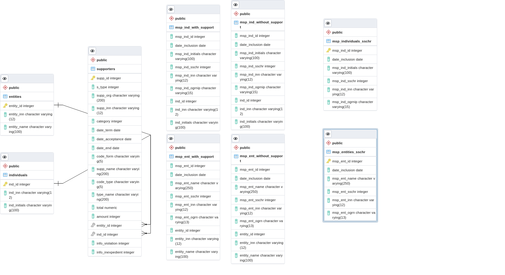

# test-task-may

### main.py

----

Происходит парсинг данных из исходного [Единого реестра субъектов малого и среднего предпринимательства – получателей поддержки](https://www.nalog.gov.ru/opendata/7707329152-rsmppp/)
с помощью модуля **xml.etree.ElementTree** в созданные таблицы entities (юр.лица), individuals(физ.лица), supporters (организации, оказавшие поддержку).
Таблицы и базу данных создал в pgadmin. За один проход мы проходим по каждому файлу, добавляем очередной элемент документа в одну из трех таблиц. В таблице
supporters есть внешний ключ, который ссылается либо на таблицу с юр.лицами, либо на таблицу с физ.лицами, в зависимости от того, кому была оказана помощь.
Были обработаны 140 файлов. 

### msp.py

----

Для обогащения полученной базы данных взял [Единый реестр субъектов малого и среднего предпринимательства](https://www.nalog.gov.ru/opendata/7707329152-rsmp/).
Брал данные о среднесписочной численности работников, если их не было, то заполнял NULL'ом. В итоге получил две таблицы *msp_entities_sschr* (юр.лица), *msp_individuals_sschr* (физ.лица). Были обработаны 109 файлов.

### msp_join_main.py

----

Происходит создание 4-ех таблиц: 
* юр.лица из *msp_entities_sschr*, которые есть в entities. **msp_ent_with_support**
* физ.лица из *msp_individuals_sschr*, которые есть в individuals. **msp_ind_with_support**
* юр лица из *msp_entitites_sschr*, которых нет в entities. **msp_ent_without_support**
* физ.лица из *msp_individuals_sschr*, которых нет в individuals. **msp_ind_without_support**
С помощью JOIN и LEFT JOIN.

### example.xml и msp_example.xml

----

Пример файлов, которые парсились в main.py и msp.py соответственно.
# Схема базы данных:
[Дамп БД](https://drive.google.com/file/d/1Th-6lEq54m4DrihDCCSvf3BhZo0j1P6c/view?usp=sharing)

